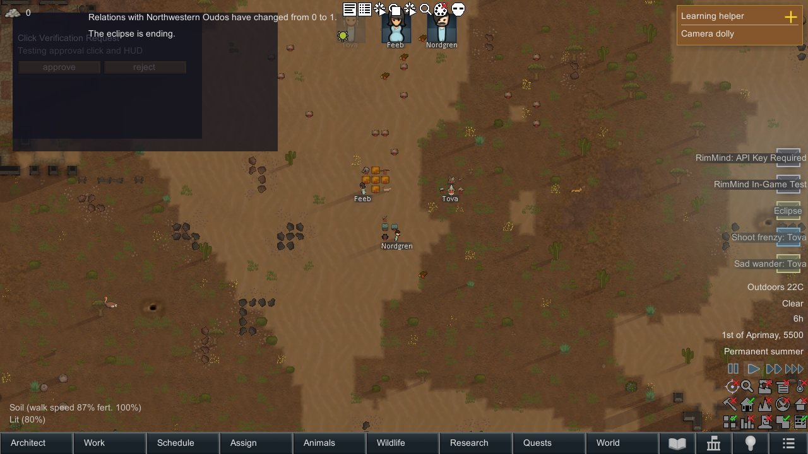
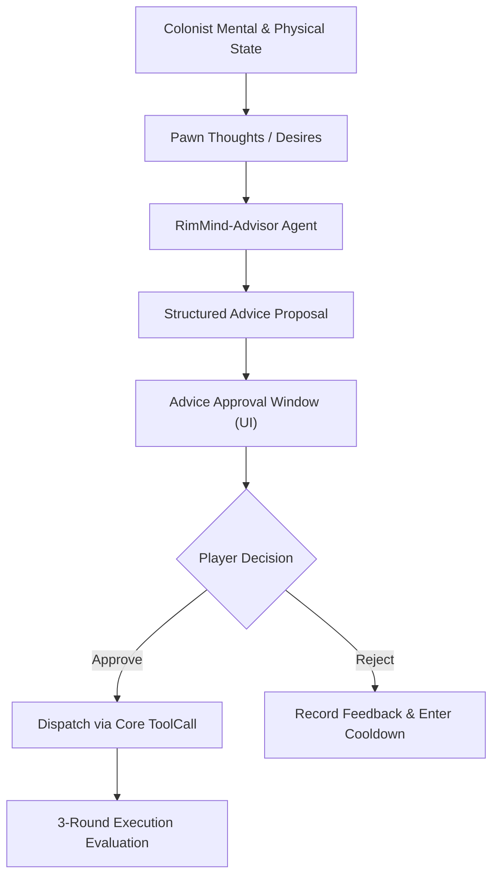

<div align="center">

# RimMind-Advisor 💡
### Autonomous Colonist Advice, Player Approval & Feedback Loop for RimWorld 1.6

**English** | [简体中文](README_zh.md)

<p>
  <a href="https://rimworldgame.com/"></a>
  <a href="https://github.com/mcocdaa/RimWorld-RimMind-Mod-Core"></a>
  <a href="#"></a>
  <a href="LICENSE"></a>
</p>

<p><em>Transform AI thoughts into meaningful colonist advice with player approval and real-time execution feedback.</em></p>

</div>

---

## 📖 Overview

**RimMind-Advisor** empowers colonists to formulate insightful suggestions based on their current psychological thoughts, environmental stresses, and personal goals. Instead of blindly overriding player commands, colonists present structured advice proposals with clear rationale and expected outcomes.

### Core Features
- **Player Approval Flow**: Advice surfaces via a non-intrusive floating HUD card displaying colonist reasoning, urgency, and proposed actions with one-click **[Approve]** and **[Reject]** buttons.
- **Smooth Mini-Pill Auto-Collapse**: When an advice proposal is decided or times out, the window automatically collapses into an elegant mini status pill `[Pending: 0]`, preventing screen clutter.
- **3-Round Feedback Loop**: Colonists track the execution outcome of approved proposals, learning whether their suggestions successfully alleviated crises or caused new setbacks.

---

## 🎮 In-Game Showcase


*In-game advice approval card: A colonist presents a tactical proposal to harvest wild medicinal herbs before winter, with interactive approve/reject options and status indicator.*

---

## 🏛️ Architecture & Clean Dependencies



---

## 🛠️ Installation & Load Order

```text
1. Harmony
2. Core (Vanilla RimWorld)
3. RimMind-Core
4. RimMind-Advisor
```

---

## 🧪 Developer Guide & Testing

Run unit tests directly:

```powershell
dotnet test RimMind-Advisor/Tests/RimMindAdvisor.Tests.csproj -c Release
```

---

## 📜 License

Licensed under the [MIT License](LICENSE).
