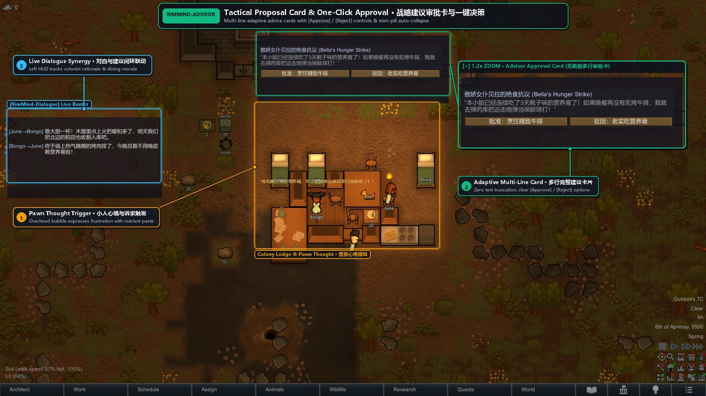
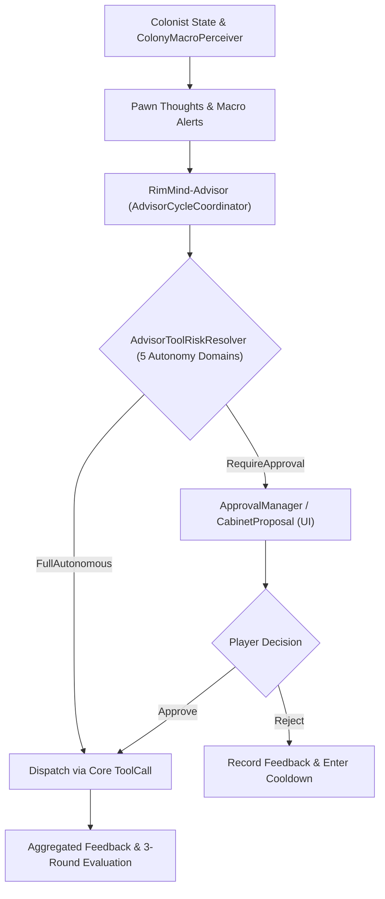

<div align="center">

# RimMind-Advisor 💡
### Autonomous Colonist Advice, Player Approval & Feedback Loop for RimWorld 1.6 & 1.7

**English** | [简体中文](README_zh.md)

<p>
  <a href="https://rimworldgame.com/"></a>
  <a href="https://github.com/RimWorld-RimMind-Mod/RimWorld-RimMind-Mod-Core"></a>
  <a href="#"></a>
  <a href="LICENSE"></a>
</p>

<p><em>Transform AI thoughts into meaningful colonist advice with 5-domain autonomy policies, player approval, and real-time execution feedback.</em></p>

</div>

---

## 📖 Overview

**RimMind-Advisor** empowers colonists to formulate insightful suggestions based on their current psychological thoughts, environmental stresses, and colony-wide macro alerts. Instead of blindly overriding player commands, colonists evaluate domain-specific autonomy policies and either execute low-risk actions directly or present structured advice proposals with clear rationale.

### Core Features
- **5-Domain Autonomy Policy & `AdvisorToolRiskResolver`**: Fine-grained autonomy levels (`Disabled`, `RequireApproval`, `FullAutonomous`) across 5 domains (`EmergencySurvival`, `ResourceMarking`, `WorktableBills`, `BlueprintPlacement`, `HighRiskOperations`), evaluated before global force-approval fallbacks.
- **Player Approval Flow & `ApprovalManager`**: Advice surfaces via a non-intrusive floating HUD card displaying colonist reasoning, urgency, and proposed actions with **[Approve]** and **[Reject]** buttons, plus automatic pending-request cleanup (`CancelPendingForPawn`) when a pawn despawns or dies.
- **`ColonyMacroPerceiver` & `CabinetMeetingCoordinator`**: Detects colony-wide food, medicine, defense, and mood crises and convenes multi-colonist cabinet proposals that execute approved `ExecutionCallbacks` directly.
- **Smooth Mini-Pill Auto-Collapse & 3-Round Feedback Loop**: Collapses into a mini status pill `[Pending: 0]` when idle and tracks execution outcomes across up to 3 feedback rounds.

---

## 🎮 In-Game Showcase


*In-game advice approval card (`[+] 1.2x ZOOM`): Triggered by colonist frustration over nutrient paste ("Bella's Hunger Strike"), the floating multi-line proposal card presents zero-truncation [Approve] and [Reject] controls alongside the active colony lodge and `[RimMind-Dialogue]` HUD.*

---

## 🏛️ Architecture & Clean Dependencies


```mermaid
flowchart TD
    Pawn["Colonist State & ColonyMacroPerceiver"] --> Thought["Pawn Thoughts & Macro Alerts"]
    Thought --> Advisor["RimMind-Advisor (AdvisorCycleCoordinator)"]
    Advisor --> Policy{"AdvisorToolRiskResolver (5 Autonomy Domains)"}
    Policy -- FullAutonomous --> Execute["Dispatch via Core ToolCall"]
    Policy -- RequireApproval --> Overlay["ApprovalManager / CabinetProposal (UI)"]
    Overlay --> Decision{"Player Decision"}
    Decision -- Approve --> Execute
    Decision -- Reject --> Cooldown["Record Feedback & Enter Cooldown"]
    Execute --> Feedback["Aggregated Feedback & 3-Round Evaluation"]
```

---

## 🛠️ Installation & Load Order

```text
1. Harmony
2. Core (Vanilla RimWorld)
3. RimMind-Core
4. RimMind-Advisor
```

---

## 🧪 Developer Guide & Testing

Run unit tests directly:

```powershell
dotnet test RimMind-Advisor/Tests/RimMindAdvisor.Tests.csproj -c Release
```

---

## 📜 License

Licensed under the [MIT License](LICENSE).
