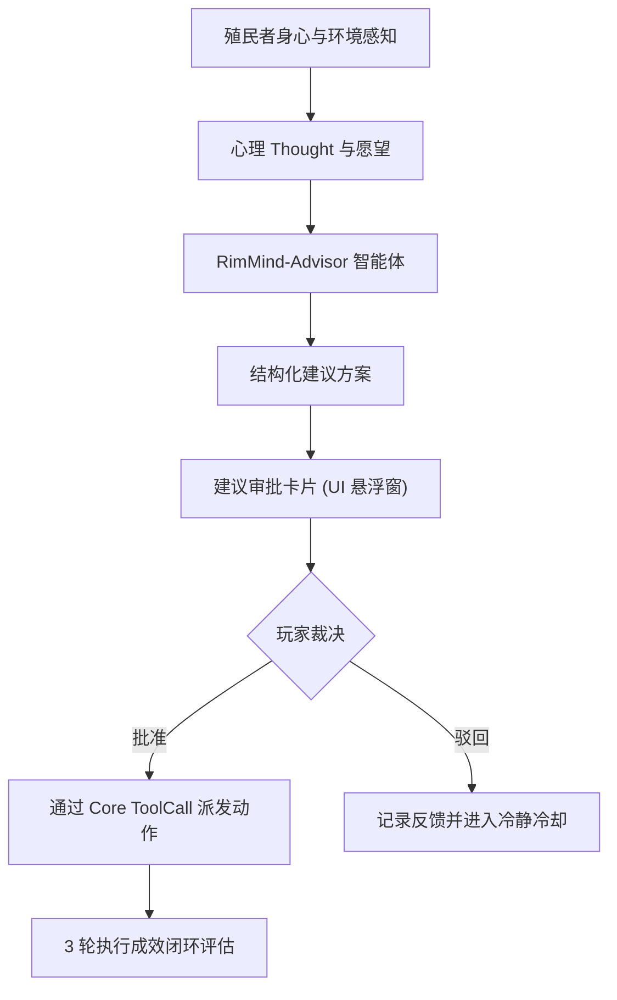

<div align="center">

# RimMind-Advisor 💡
### 专为 RimWorld 1.6 打造的殖民者自主建言、玩家审批与执行反馈闭环系统

[English](README.md) | **简体中文**

<p>
  <a href="https://rimworldgame.com/"></a>
  <a href="https://github.com/mcocdaa/RimWorld-RimMind-Mod-Core"></a>
  <a href="#"></a>
  <a href="LICENSE"></a>
</p>

<p><em>将 AI 心理感知沉淀为有理有据的战略建言，通过玩家审批与多轮反馈形成认知闭环。</em></p>

</div>

---

## 📖 模块概览

**RimMind-Advisor** 赋予殖民者根据当前身心状态、环境危机和长远期望提出建议的能力。它绝不野蛮接管玩家的最高统治权，而是以兼具角色个性与说服力的卡片向玩家建言献策。

### 核心特性
- **优雅的玩家审批流**：建议卡片悬浮于屏幕，展示小人真实动机、紧迫度与拟采取举措，提供一键【批准】与【驳回】选项。
- **迷你胶囊平滑自动收缩**：完成审批或超时后，悬浮窗顺滑收缩为极简胶囊 `[Pending: 0]`，彻底杜绝遮挡战场视线。
- **3 轮执行反馈回路**：持续跟踪已批准动作的实际执行成效，小人能从成功或失误中总结经验教训。

---

## 🎮 实机特性展示


*游戏内建议卡片实机：小人根据冬季前草药告急提出外出采摘建议，附带互动审批与迷你胶囊状态指示。*

---

## 🏛️ 系统架构与闭环流转



---

## 🛠️ 安装与加载顺序

```text
1. Harmony
2. Core (RimWorld 原版)
3. RimMind-Core
4. RimMind-Advisor
```

---

## 🧪 开发者测试指南

运行单元测试：

```powershell
dotnet test RimMind-Advisor/Tests/RimMindAdvisor.Tests.csproj -c Release
```

---

## 📜 开源协议

本项目采用 [MIT License](LICENSE) 开源许可证。
